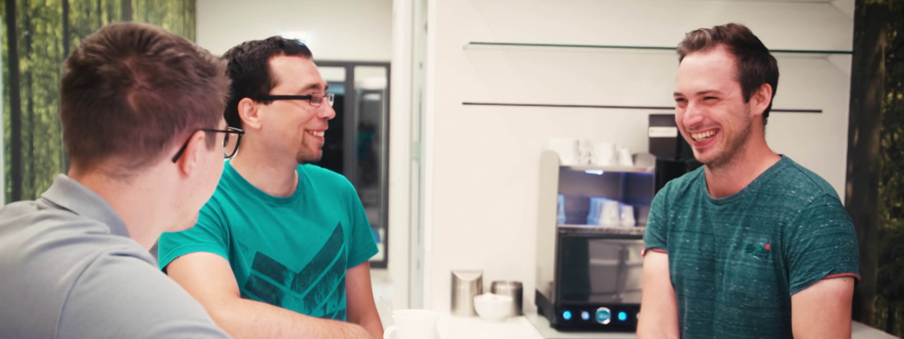
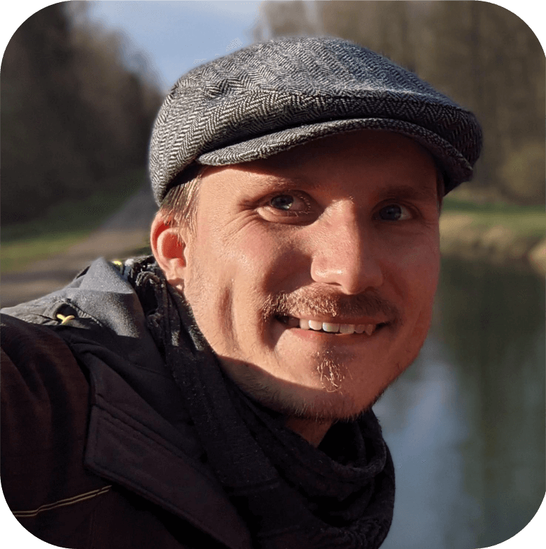
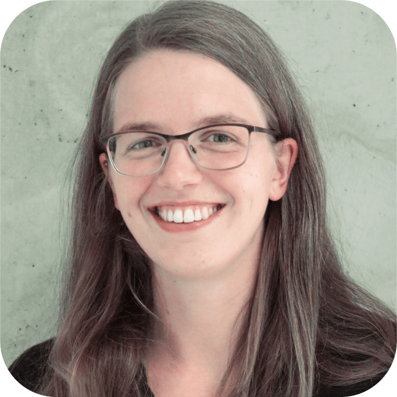
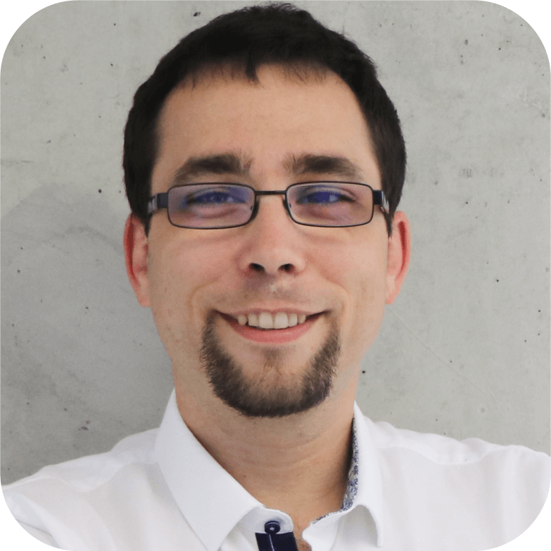

Ein Team. Eine Taskforce. Eine Mission: AraCom entwickelt individuelle Softwarelösungen für namhafte Unternehmen unterschiedlicher Branchen – **für den täglichen Release einer besseren Version unserer Welt!**

Das funktioniert natürlich nur mit **modernsten Technologien, branchenübergreifender Erfahrung** und einem **unschlagbaren Team**.

Mit Hauptsitz in Augsburg und Niederlassungen in München, Stuttgart und Bamberg ist AraCom der zuverlässige Partner rund um Entwicklung sowie Implementierung von Individualsoftware und UI/UX-Design. Das Team besteht aus über 200 hoch ambitionierten Menschen in den Bereichen Development, IT-Consulting, UI/UX, Sales, Marketing und HR. Gemeinsam arbeiten wir täglich mit großer Leidenschaft daran, unsere Kunden für alle Chancen und Herausforderungen der Digitalisierung zu wappnen. 

## Warum es toll ist, Teil von uns zu sein
**„the whole is greater than the sum of it’s parts“**

Unsere Devise ist: „Nur wenn’s Spaß macht, wird’s auch richtig gut“. Aus diesem Grund geben wir unser Bestes, eine Wohlfühlatmosphäre zu pflegen, welche zugleich produktiv als auch motivierend ist. Zudem bieten wir Freiraum, um auch im Daily-Business die AraCom-Gefährten besser kennenzulernen, gemeinsam zu lachen und Erfolge zu feiern. Nur so kann das gesamte Team sowohl fachlich als auch persönlich über sich hinauswachsen.

Das erwartet dich sonst noch als Teil unseres Teams: `[Techcommunity]`, `[Kostenlose Kalt- & Heißgetränke im Office]`, `[Feelgood Management]`, `[Teamevents]`, `[Weiterbildungsbudget]`, `[Jobrad]`, `[Firmenwagen]`, `[Moderne Hardware]`, `[Peripheriegerätekatalog]`, `[Vermögenswirksame Leistungen]`, `[Fitnessangebot] & [Homeoffice]`.
 

## Ein Teil unseres Teams (4 von 200)

### Daniel | `Full Stack Developer & Entwicklungsleiter`

> **Lieblingstechnologien:**  
`.NET`, `C#`, `Azure` 

> **Gute Softwareentwicklung bedeutet für dich:**  
Aktuelle Technologien vernünftig einsetzen, um Mehrwert für Kunden zu erzeugen. 

> **Tee, Kaffee oder doch heiße Schoki?**  
Am liebsten Kaffee!

> **Gründe, wieso man Teil des AraCom-Teams werden sollte:**  
Abwechslungsreiche Projekte in familiärer Arbeitsumgebung mit großem Gestaltungsspielraum.

### Kai | `Softwarearchitekt & Projektleiter`

> **Lieblingstechnologien:**  
`Spring Boot`, `Spring Cloud`, `Kubernetes`, `Python Ecosystem`, `Linux all the wayyy` 

> **Inspiration findest du in:**  
 Meditation und langen Strandspaziergängen.. Spaß. Hands on, Fehler machen und draus lernen!

> **Tee, Kaffee oder doch heiße Schoki?**  
Je nach Tageszeit und Treibstoffbedarf Kaffee oder Redbull.

> **Gründe, wieso man Teil des AraCom-Teams werden sollte:**  
Das Leben ist zu kurz, um es nicht zu sein!

### Lena | `Frontend Entwicklerin`

> **Lieblingstechnologien:**  
`.NET`, `C#`, `Blazor`

> **Wieso liebst du das Entwickeln im Frontend?**  
Das Ergebnis meiner Arbeit in einer sauberen, responsiven UI zu sehen, macht mich zufrieden. 😊

> **Tee, Kaffee oder doch heiße Schoki?**  
Eindeutig Tee, mit Kaffee kann ich nichts anfangen und heiße Schoki gibt es nur, wenn ich im Büro arbeite. 

> **Gründe, wieso man Teil des AraCom-Teams werden sollte:**  
Der bunte Mix an tollen Kolleg:innen, eine umfangreiche Auswahl an Projekten mit den unterschiedlichsten Technologien – also viel Raum für dich und deine persönliche und berufliche Weiterentwicklung. Dazu gehört auch, dass wir flexible Arbeitszeiten haben und verschiedene Homeoffice-Modelle! 

### Christian | `DevOps-Specialist & Projektleiter`

> **Lieblingstechnologien:**  
`Docker`, `Git`, `JavaScript & Bash`

> **Was bedeutet DevOps für dich?**  
DevOps ist für mich definitiv mehr als nur CI/CD Pipelines.  
Für mich bedeutet es, Entwickler in ihrem gesamten Prozess zu unterstützen.  
Von der lokalen Entwicklungsumgebung bis zum Betrieb in Cloud- oder Serverumgebungen.

> **Tee, Kaffee oder doch heiße Schoki?**  
"Tea, Earl Grey, Hot".  
Aber morgens meistens dann doch wieder Kaffee, um in den Tag zu starten.  
Dafür dann aber einen guten selbstgemahlenen mit French Press gemacht.

> **Gründe, wieso man Teil des AraCom-Teams werden sollte:**  
Das familiäre Umfeld ist bei uns nicht nur ein schönes Buzzword aus den Stellenbeschreibungen, sondern wird tatsächlich gelebt. Bei AraCom unternehmen wir viel - auch außerhalb der Arbeitszeit miteinander.

## Werde Teil unseres Teams! 

Wir sind immer auf der Suche nach weiteren tollen Weggefährten, die es lieben, exzellente Software zu entwickeln und das gemeinsam mit einem unschlagbaren Team! Vielleicht siehst du dich in einer der folgenden Positionen:
 
-> [(Junior) Softwareentwickler (M/W/D) Mobile .NET Java Web](https://crm.aracom.de/Job/Permanent/75ac6115-714a-4dd8-aa4c-e068ead386aa)  
-> [PHP Entwickler (M/W/D)](https://crm.aracom.de/Job/Permanent/14135cc7-c49b-4f39-b249-8b28b3caaf49)  
-> [Product Owner (M/W/D)](https://crm.aracom.de/Job/Permanent/8df8ad5c-420d-44b6-a357-0b549dbb5058)  
